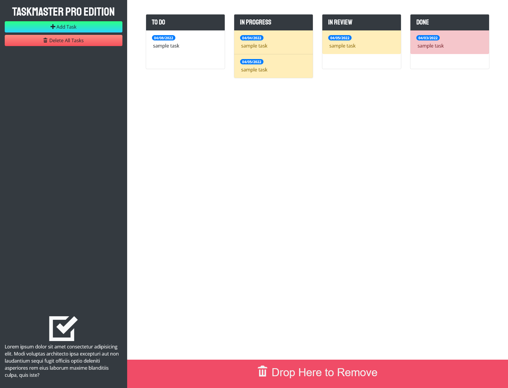

# TASKMASTER PRO
### Front End Web App

## Description

TASKMASTER PRO EDITION allows it's users to keep track of their To-Do Lists. Additionally, the status of the task can also be tracked. This app persists data through a page refresh. Users have the option to delete all their tasks or remove a single task.

## Table of Contents

- [Usage](#usage)
- [License](#license)
- [Author](#author)
- [Badges](#badges)

## Usage

Click [here](https://d-whipp.github.io/taskmaster-pro/) and you'll be taken to the hosted site. From there you have the option to:
- Add a task 
- Click and drag the task to it's appropriate status
- Delete a single task by dragging it to the bottom of the screen
- Delete all tasks with the click of a button

## License

MIT License

Copyright (c) [2021] [David Whipple]

Permission is hereby granted, free of charge, to any person obtaining a copy of this software and associated documentation files (the "Software"), to deal in the Software without restriction, including without limitation the rights to use, copy, modify, merge, publish, distribute, sublicense, and/or sell copies of the Software, and to permit persons to whom the Software is furnished to do so, subject to the following conditions:

The above copyright notice and this permission notice shall be included in all copies or substantial portions of the Software.

THE SOFTWARE IS PROVIDED "AS IS", WITHOUT WARRANTY OF ANY KIND, EXPRESS OR IMPLIED, INCLUDING BUT NOT LIMITED TO THE WARRANTIES OF MERCHANTABILITY, FITNESS FOR A PARTICULAR PURPOSE AND NONINFRINGEMENT. IN NO EVENT SHALL THE AUTHORS OR COPYRIGHT HOLDERS BE LIABLE FOR ANY CLAIM, DAMAGES OR OTHER LIABILITY, WHETHER IN AN ACTION OF CONTRACT, TORT OR OTHERWISE, ARISING FROM, OUT OF OR IN CONNECTION WITH THE SOFTWARE OR THE USE OR OTHER DEALINGS IN THE SOFTWARE.

## Author

Hello! My name is David. 
Email is dwhipp88@gmail.com.  
[LinkedIn](https://www.linkedin.com/in/david-w-079841213/)  
If you're interested in seeing more of my work then check out my [portfolio](http://mighty-brook-32674.herokuapp.com/) or you can view my [github](https://github.com/D-Whipp).

## Badges

